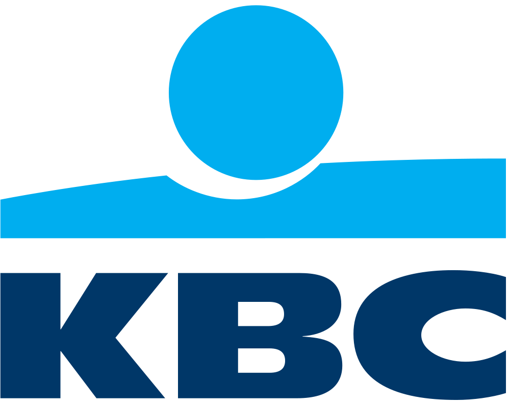

<p align="center">
  
</p>

<h1 align="center">KBC Right Moment</h1>

<p align="center">
  <b>The right button, at the right moment, for every one of KBC's 2.3 million customers.</b><br/>
  <sub>Tectonic hackathon · KBC challenge</sub>
</p>

---

> **The challenge:** *How can a bank understand what a customer needs and respond at exactly the right moment, at the scale of 2.3 million customers?*
>
> **Our answer:** don't build another chatbot or another inbox full of offers. Change **the buttons the customer already taps**. The KBC app's login screen and dashboard get a small set of quick actions that adapt to where the customer is, what just happened in their account and what's coming up in their life, and each one says why it's there.

## 30-second pitch

A bank already knows a lot about its customers: a salary just came in, a baby was added to the family, €45,000 of savings hasn't moved in three years. The phone also knows the customer just parked or is standing on a train platform. Today almost none of that reaches the home screen, and every customer sees the same fixed buttons.

**Right Moment** turns those signals into a short list of ranked, explained actions and puts them on the right surface:

| When… | …the app shows |
| --- | --- |
| 🅿️ You just parked in the city | **Pay parking**, right on the login screen |
| 🚆 You're at the station at 8 AM | **Train ticket**, before you even log in |
| 🍼 A baby joined your family | **Start a savings account for your child** |
| 🎂 You turn 18 next week | **Open your own account** |
| 🌙 You open the app at 3 AM | **"You're on track: see overview"**. Reassurance, not a sales pitch |

Every contextual button has an **ⓘ "Why am I seeing this?"** that names the exact signals behind it.

## Why this wins

| | |
| --- | --- |
| 🎯 **Useful from the first tap** | It meets needs the customer has *right now* (parking, tickets, card at the till) and earns the attention that the bigger moments (child, inheritance, retirement) need. |
| 🔍 **Explainable by design** | Readable rules, not a black box. Every recommendation carries its reason, which matters to customers, compliance and regulators (GDPR, EU AI Act). |
| 🛡️ **Safe surfaces** | Only low-risk actions (show card, pay parking, train ticket, balance, block card) may appear *before* authentication. Financial advice stays behind login. |
| 🤍 **Empathetic** | Late-night sessions often mean worry. The engine notices and leads with a calm overview instead of an investment pitch. |
| ⚡ **Built for 2.3M customers** | Scoring is stateless: a few dozen comparisons per request, no model inference. It runs per event (on-device, at the edge or in a small service), with no nightly batch over the whole customer base. |
| 🔁 **Learns** | Every impression, click and "why?" tap is logged. Clicked actions get a personal boost, and the data supports A/B testing and uplift measurement. |
| 🧩 **Extends with two edits** | A new "moment" is one signal and one rule. The same engine can serve the app, the website and an advisor view in the branch. |

## How it works

```
 ┌──────────────┐    ┌──────────────┐    ┌───────────────┐    ┌────────────────────────┐
 │   SIGNALS    │ →  │    RULES     │ →  │    RANKING    │ →  │        SURFACES        │
 │ transactions │    │ signal → act │    │ weight        │    │ 🔓 Login: low-risk only │
 │ profile      │    │ + reason     │    │ × confidence  │    │ ✨ Dashboard: "For you, │
 │ behaviour    │    │              │    │ + time boost  │    │    now" widget          │
 │ device       │    │              │    │ + your clicks │    │                        │
 │ location     │    │              │    │               │    │  ⓘ why? on every card   │
 └──────────────┘    └──────────────┘    └───────────────┘    └────────────────────────┘
        ▲                                                                  │
        └──────────────────── interactions logged (feedback loop) ─────────┘
```

1. **Signals** (`src/engine/signals.ts`) are derived from:
   - **Transactions:** salary just in, unusual inflow, idle savings, many subscriptions, daycare payments
   - **Profile:** turning 18/21/65 soon, pre-retirement age, a new child in the family
   - **Behaviour:** late-night use
   - **Device:** login from a new phone
   - **Location:** car parked, on the train or at a station, abroad, in a shop
2. **Rules** (`src/engine/rules.ts`) map signals to actions. Each rule has a base weight, the surfaces it may appear on and a plain-language reason template.
3. **Ranking:** `score = weight × (1 + 0.15 × (extra matching signals)) + context boost + feedback boost`. More matching signals means more confidence. Each past click adds +5 for that customer, capped at +15, so the engine personalises without running away with itself.
4. **Surfaces:** the top 3 contextual actions go first on the login screen, followed by the familiar standard tiles (QR pay, Kate Wallet, Receive money, Kate Coins). The top 3 dashboard actions fill the **"✨ For you, now"** widget. No signals means no noise: the customer just sees the standard actions.

### Worked example: Marc, 58, at 03:00

Marc received a €45,000 inheritance six days ago, and his €12,000 savings haven't moved in three years. He opens the app at 3 AM.

| Action | Signals matched | Score |
| --- | --- | --- |
| 🌙 You're on track: see overview | `lateNight` | **95** |
| 📈 Put idle savings to work | `idleCapital`, `suddenInflow` | 80 × 1.15 = **92** |
| 🤝 Talk to an advisor | `suddenInflow`, `preRetirement` | 72 × 1.15 = **83** |

Reassurance comes first. Move the clock to 14:00 in the control room and the calm overview disappears, so the investment and advisor suggestions lead.

## Live demo

The demo page has a **phone mockup** on the left and a **control room** on the right. Pick a customer, change the time, place and way of travelling, and watch the buttons re-rank instantly. The control room shows the detected signals, the scores and live database stats (events, recommendations, interactions, top actions).

**Suggested 2-minute walkthrough for the jury:**

1. **🚗 Jonas** (commuter, salary just in, 5 subscriptions). He starts at 08:00, parked in the city, so **Pay parking** tops the login screen. Switch location to *station* and **Train ticket** takes its place. The dashboard suggests *Review your subscriptions* and *Auto-save part of your salary*.
2. **🎓 Lotte** (turns 18 in 6 days, in a shop, new phone). Login shows **Show card** and **Block card**, and the dashboard shows **Turning 18? Open your own account** and **Confirm your new device**.
3. **🍼 Sarah** (baby born 2 months ago, daycare payments). The login screen stays standard because nothing urgent is happening. The dashboard shows **Start a savings account for your child** and **Check your family insurance**.
4. **🧓 Marc** at 03:00, then at 14:00 (see the worked example above).
5. Tap **ⓘ** on any button to see the reasoning. Click a suggestion a few times and watch it climb in that customer's ranking.

## Getting started

Requires **Node.js 22.13+**, which ships SQLite built in (`node:sqlite`). No other database or service is needed.

```bash
npm install
npm run dev
```

- Web app: http://localhost:5173 (Vite forwards `/api` to the backend)
- API: http://localhost:3001

The SQLite database `kbc.db` is created automatically and seeded with the 4 demo customers. To reset it, stop the servers, delete `kbc.db*` and run `npm run dev` again. Node prints an "SQLite is experimental" warning, which is harmless.

```bash
npm run server   # API only
npm run build    # typecheck + production build of the frontend
```

## API

| Method | Endpoint | Description |
| --- | --- | --- |
| `GET` | `/api/customers` | All customers (personas) |
| `POST` | `/api/customers/:id/context` | Body `{ hour, location, transport }`. Detects signals, ranks actions, stores the event and returns `{ eventId, signals, login, dashboard, all }` |
| `POST` | `/api/interactions` | Body `{ customerId, actionId, kind: "click" \| "why" }` |
| `GET` | `/api/stats` | Totals plus shown/clicks per action |

`location` is one of `home | work | city | shop | station | abroad`. `transport` is one of `walk | car | train | null`.

```bash
curl -X POST http://localhost:3001/api/customers/jonas/context \
  -H "Content-Type: application/json" \
  -d '{"hour":8,"location":"station","transport":"train"}'
```

## Data model

| Table | Contents |
| --- | --- |
| `customers` | Persona JSON (seeded from `src/data/personas.ts`) |
| `context_events` | Every context update: customer, hour, location, transport |
| `signals` | Signals detected per event |
| `recommendations` | Actions shown per event, with surface, rank and score |
| `interactions` | Button clicks and "why?" taps |

Together these give a full audit trail of what was shown, why, and what the customer did with it. That trail is what makes measurement and compliance possible.

## Project structure

```
public/logo.png      KBC logo (login screen, dashboard, control room, favicon)
server/
  index.ts           Express REST API
  db.ts              SQLite schema, seeding, transaction helper
src/
  engine/
    types.ts         Persona, Context, Signal, Action
    signals.ts       detectSignals(persona, context)
    rules.ts         rules, scoring and rankActions(signals, context, feedback)
  data/personas.ts   demo customers (database seed)
  api.ts             fetch wrappers for the frontend
  components/        LoginScreen, Dashboard, ActionButton, ControlRoom
  App.tsx
```

**Adding a new moment** takes two edits: add a signal in `src/engine/signals.ts`, then add a rule in `src/engine/rules.ts` with the signals it needs, a weight, the surfaces it may appear on and a reason.

## From prototype to production

| Step | What |
| --- | --- |
| **1. Consent** | A preference centre where customers choose which signals (location, transactions, …) may be used, and can switch suggestions off |
| **2. Real signals** | Hook the engine onto KBC's transaction stream and the app's location and device events |
| **3. Smarter ranking** | ML-based profiles from spending clusters, alongside the explainable rules rather than replacing them |
| **4. More moments** | Subscriptions controller, idle-capital coach, Kate Coins rewards for good financial habits |
| **5. More channels** | Website, push notifications, an advisor view in the branch, all using the same engine |
| **6. Measure** | A/B tests and uplift measurement on the interaction data that's already being logged |

## Stack

React 18 · TypeScript · Vite · Express 5 · SQLite (`node:sqlite`)

<p align="center"><sub>Built at the Tectonic hackathon for the KBC challenge.</sub></p>
